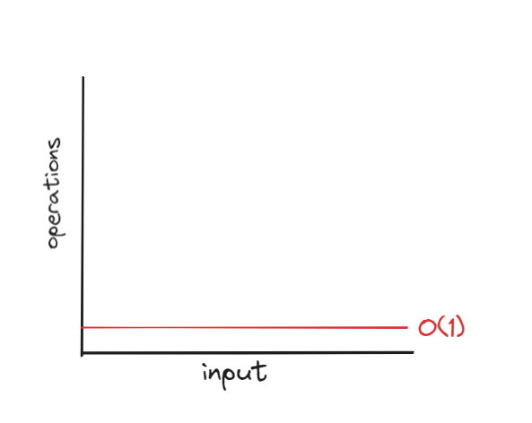

# Data Structure And Algorithm

### Time and Space Complexity

Time Complexity != time taken by a particular program to run 

Every platform and device takes a different amount of time to execute and complete different tasks. So, time complexity is not about the time taken by a program to run.

### Then, What is Time Complexity ? 

- Time complexity is a concept in computer science that tells us how much time or resources an algorithm needs to solve a problem, based on the size of the input. It helps us understand how the runtime of an algorithm changes as we give it more data to work with, which means it shows how the number of operations performed by the algorithm increases as the input size grows.

For example: 
```
    // Function to find the sum of all elements in an array using a simple loop
    function sumArray(arr) {
        let sum = 0;
        for (let i = 0; i < arr.length; i++) {
            sum += arr[i];
        }
        return sum;
    }

    // Example usage
    const arr1 = [1, 2, 3, 4, 5];
    console.log("Sum of arr1:", sumArray(arr1)); // Output: Sum of arr1: 15

    const arr2 = [1, 2, 3, 4, 5, 6, 7, 8, 9, 10];
    console.log("Sum of arr2:", sumArray(arr2)); // Output: Sum of arr2: 55
```

The time complexity of this function is O(n), where 'n' is the size of the array. As the size of the array increases, the number of iterations in the loop also increases linearly.

### But, What is O(n) ?
It is Big O notation, O(n) represents the time complexity of an algorithm that grows linearly with the size of the input. Here, 'n' represents the size of the input, such as the number of elements in an array.

### What is Notation ?
Notation means using symbols or characters to show ideas or information in a simple and standard way. In math and computer science, it helps express complicated ideas clearly and without confusion.

Big O notation uses the letter "O" followed by a mathematical expression, typically involving the variable "n" to represent the size of the input. For example, O(n) represents linear time complexity, O(n^2) represents quadratic time complexity, and so on.


#### Why understanding worst case scenario is crucial (Big O notation) ?
Big O notation, specifically focusing on the worst-case scenario, is crucial for several reasons:

1. Predictive Analysis: It helps predict how an algorithm will perform as the size of the input grows to infinity. Understanding the worst-case scenario allows developers to anticipate potential performance issues and plan accordingly.

2. Algorithm Comparison: Big O notation allows for easy comparison between different algorithms solving the same problem. By analyzing their worst-case complexities, developers can choose the most efficient algorithm for a given task.

3. Optimization: Recognizing the worst-case scenario prompts developers to optimize algorithms to perform better in those situations. This optimization can lead to more efficient code and better overall performance.

4. Resource Management: In addition to time complexity, Big O notation can also represent space complexity. Understanding how an algorithm consumes resources, such as memory or processing power, is essential for efficient resource management in applications and systems.

### Common Complexity

1. O(1): Constant
`O(1) represents constant time complexity in Big O notation. This means that regardless of the size of the input, the algorithm will always take the same amount of time to execute. In other words, the runtime of the algorithm does not depend on the size of the input.`

```
    function totalSum(arr) {
        console.log("Hello world")
    }
    let arr = [1, 2, 3, 4, 5, 6]
    totalSum(arr)
```
